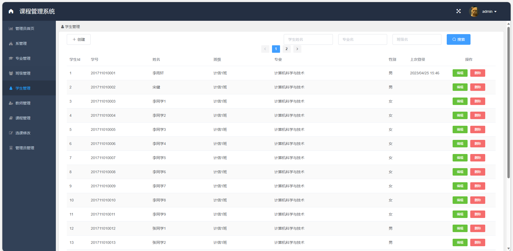
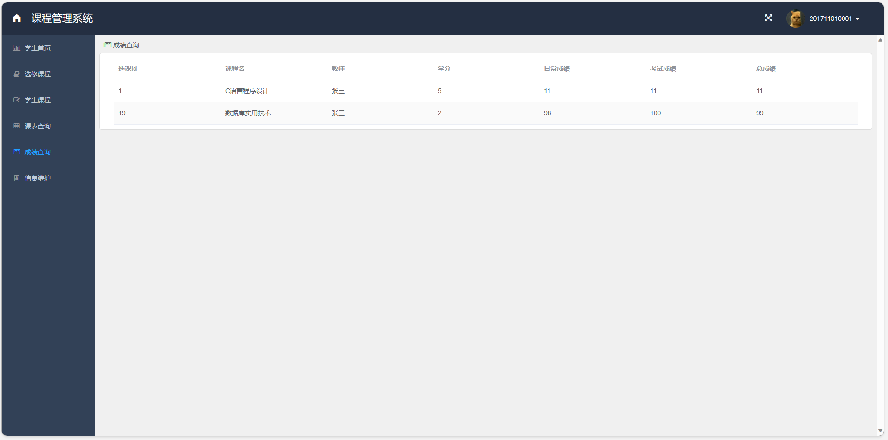

# 学生选课成绩管理系统

## 一、介绍

基于Springboot+Vue的前后端分离学生选课成绩管理系统

可做学生选课管理系统，学生课程管理系统，学生成绩管理系统

运行环境:idea或eclipse vscode 数据库:mysql

开发语言：java

技术栈：Java+SpringBoot+Mysql+Redis+vue+elementui

分为学生，教师，管理员三种角色。

1、管理员模块
系管理 专业管理 班级管理 学生管理 教师管理 课程管理 选课修改 管理员管理

2、教师模块
教师首页 授课查询 教师课表 成绩录入

3、学生模块
学生首页 选修课程 学生课程 课表查询 成绩查询 信息维护


## 二、功能界面截图


### 1、管理员模块部分功能界面展示





### 2、教师模块部分功能界面展示


### 3、学生模块部分功能界面展示




## 三、视频演示

```
链接：https://pan.baidu.com/s/12lGawaoGaQqCzuYkgOGEsw?pwd=d56y

提取码：d56y

--来自百度网盘超级会员V6的分享
```

## 四、 9.9￥ 获取完整源码+sql，需要加Q：3808981644 备用Q：3577148218
## 有问题，或者需要协助调试运行项目的也可联系

